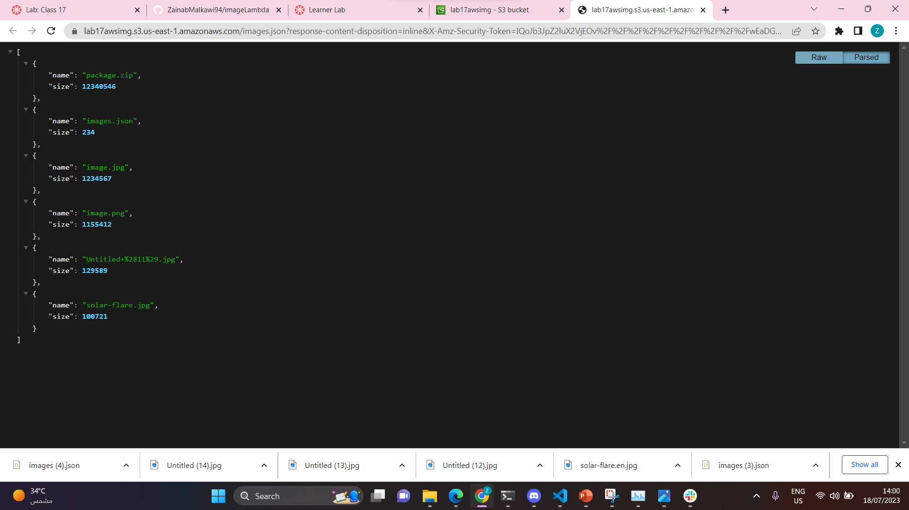

# imageLambda

## a description of how to use your lambda.
This AWS Lambda function is designed to handle image uploads to an S3 bucket and manage a JSON file (images.json) containing metadata for all the uploaded images. When a new image is uploaded to the S3 bucket.

-----------------------

## a description of any issues you encountered during deployment of this lambda.
size of the file  was greater than 10 mega.
ACL. 

------------------------
## this image is screen shoot to the images.json file .

URL: https://l1nq.com/zdYVM

------------------------------------
## these are the url of images that i published on s3.

.jpg)

-------------------------------------------
## function overview:

-----

## S3 Screenshot: 

 -------
 ## test screenshot:

 

---------
## Log ScreenShot:

